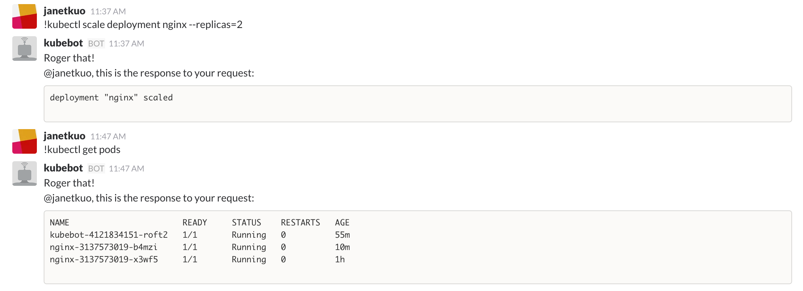

# Kubebot

Kubebot is a Kubernetes chatbot for Slack. 

This project is in active development and it's __not ready__ for production yet.

## Prerequisite

First, you’ll need a Kubernetes cluster. You can start with creating a Kubernetes cluster with Google Container Engine following the [quickstart](https://cloud.google.com/container-engine/docs/quickstart), or pick other solutions from [here](http://kubernetes.io/docs/getting-started-guides/).


## Setup

To run Kubebot on Slack, first you need to [create a new bot](https://my.slack.com/services/new/bot) user integration on Slack and get the `token` (See [Slack bot users](https://api.slack.com/bot-users) for more details).

Then you need to know the channel ids where you want to run the Kubebot. You can get them on `https://slack.com/api/channels.list?token={REPLACE WITH YOUR TOKEN}`

## How to run it

### Create a Secret

First, create a Kubernetes [Secret](http://kubernetes.io/docs/user-guide/secrets/) to hold your sensitive information.

```
kubectl create secret generic kubebot --from-literal=token=<your_token_here> --from-literal=channel=<your_channel_id_here>
```

### Create a kubebot Deployment

Then, create the following kubebot Deployment that consumes the secret you just created, and that’s it!

Open the (kubebot-deployment.yaml)[kubebot-deployment.yaml] file and modify the kubebot container environment variables to control things like who the kubebot will listen to, and what valid kubectl commands are allowed.

```yaml
apiVersion: extensions/v1beta1
kind: Deployment
metadata:
  name: kubebot
  labels:
    component: kubebot
spec:
  replicas: 1
  template:
    metadata:
      labels:
        component: kubebot
    spec:
      containers:
      - name: kubebot
        image: harbur/kubebot:0.1.0
        imagePullPolicy: Always
        env:
        # Create a secret with your slack bot token and reference it here
        - name: KUBEBOT_SLACK_TOKEN
          valueFrom:
            secretKeyRef: 
              name: kubebot
              key: token 
        # Create a secret with your slack bot channel id and reference it here
        - name: KUBEBOT_SLACK_CHANNELS_IDS
          valueFrom:
            secretKeyRef: 
              name: kubebot 
              key: channel
        # Alternatively, use this instead if you don't need to put channel ids in a secret; use a space as a separator
        # - name: KUBEBOT_SLACK_CHANNELS_IDS
        #   value: "1234 4321" 
        # Specify slack admins that kubebot should listen to; use a space as a separator
        - name: KUBEBOT_SLACK_ADMINS_NICKNAMES
          value: "user1 user2"
        # Specify valid kubectl commands that kubebot should support; use a space as a separator
        - name: KUBEBOT_SLACK_VALID_COMMANDS
          value: "get describe scale"
```


```console
$ kubectl create -f kubebot-deployment.yaml
deployment "kubebot" created
```


### Alternative: Running the binary

It is possible to run the binary locally or in a server. First you need to download and compile this project using the Go compiler:

```
mkdir -p $GOPATH/github.com/harbur/kubebot
cd $_
git clone git@github.com:harbur/kubebot.git
go install -v github.com/harbur/kubebot
```

Then set up the following environment variables:

```
# use the token you generated in the setup
KUBEBOT_SLACK_TOKEN="replacewithyourtoken" 

# use as many channels ids you want; use a space as a separator
KUBEBOT_SLACK_CHANNELS_IDS="1234 4321" 

# use as many admin nicknames as you want; use a space as separator
KUBEBOT_SLACK_ADMINS_NICKNAMES="nickname1 nickname2" 

# set which kubectl commands the admins will be able to run
KUBEBOT_SLACK_VALID_COMMANDS="get describe logs explain"
```

After the setup, you can run the binary:

```
kubebot
```

### Interact with the bot

Now, start asking the bot to run those [kubectl](http://kubernetes.io/docs/user-guide/kubectl/kubectl/) commands for you.




